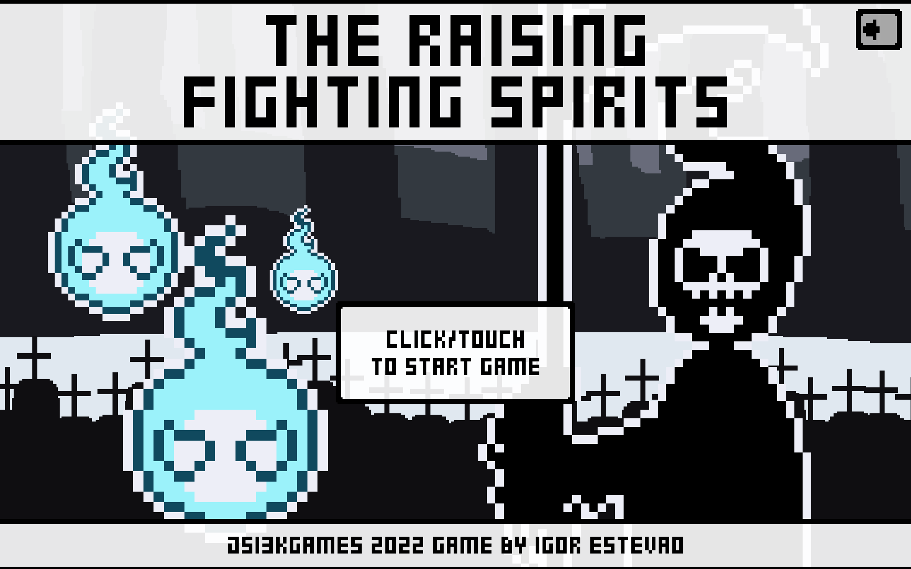
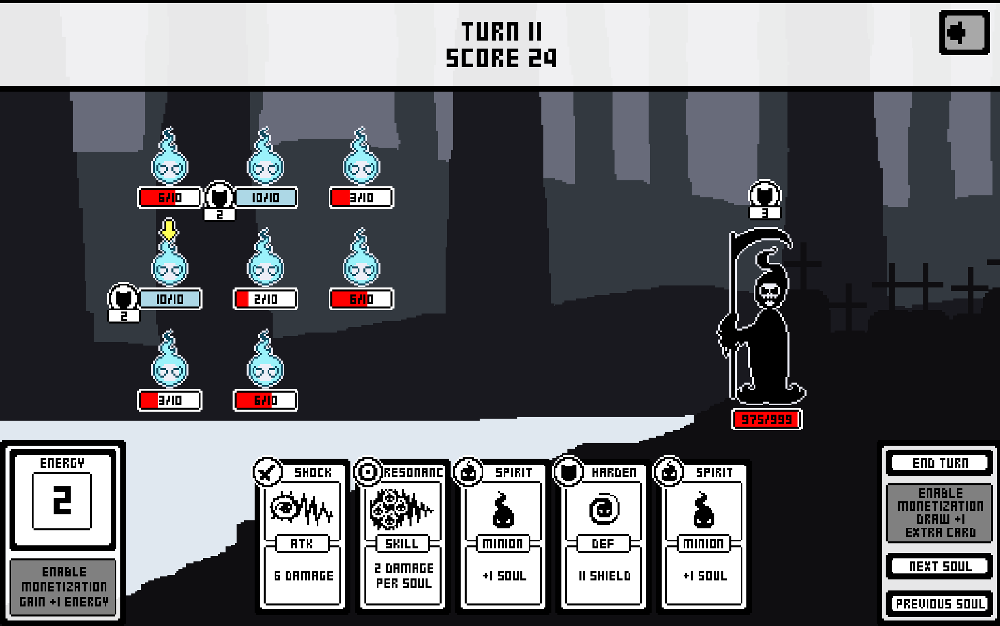

# The Raising Fighting Spirits

Is a simple card game where you fight against the grim reaper using a hord of fighting spirits!

You can play a live version here: https://igorfie.gitlab.io/theraisingfightingspirits/

This game was created for the [2022 js13kGames](https://js13kgames.com/) where the theme was `DEATH`.

## TODO-FOR-THE-FUTURE-ME
Since the limit of space was 13kbs I was out of space but in the future I may:
- Implement auto resizing so the game automatically ajusts without the need of refreshing the page.
- Implement card deck so the player can know what cards are in the deck.
- Implement card events so the player can add cards to the deck, this would allow players to create an unique deck during a run.
- Implement souls special traits, for example:. a cat soul has 7 lifes, an owl soul allows you to see the first card of your next turn.
- Souls having diferent sprites and colors.
- Some card ideas:
    - heal a selected minion
    - sacrifice 5 random souls to spawn a devil soul (100 life, damage cards have double effect)
    - selected soul becomes invisible (reaper can't atk it next turn)

### Setup
Run `npm install` on a terminal

### Development
Run `npm run start` to start the game in a development server on `localhost:8080`.

### Production
Use `npm run build` to create minified file and zip him with the `index.html`. The result will be available in the `dist` directory.

